# DTM Desktop-Mapping

## Neun Karten, neun Methoden

<table>
<tr>
<td width="85%" valign="top">

Willkommen in meinem Kartenarchiv zum Modul <strong>DTM – Desktop-Mapping</strong> an der BHT Berlin. Im Laufe des Semesters ist zu jeder Episode eine eigene Karte entstanden – von Berliner Einwohnerdichten über Kirschblüten, Wahlkreise und Fluchtrouten bis zu Sternschnuppen, Orkanwirbeln und Gebäuden in 2,5D und 3D. Zu jeder Karte gibt es hier eine kurze Einordnung der Methode mit ihren Stärken und Schwächen sowie eine Beschreibung, wie sie in <strong>QGIS</strong> umgesetzt wurde.

</td>
<td width="15%" valign="middle" align="center">
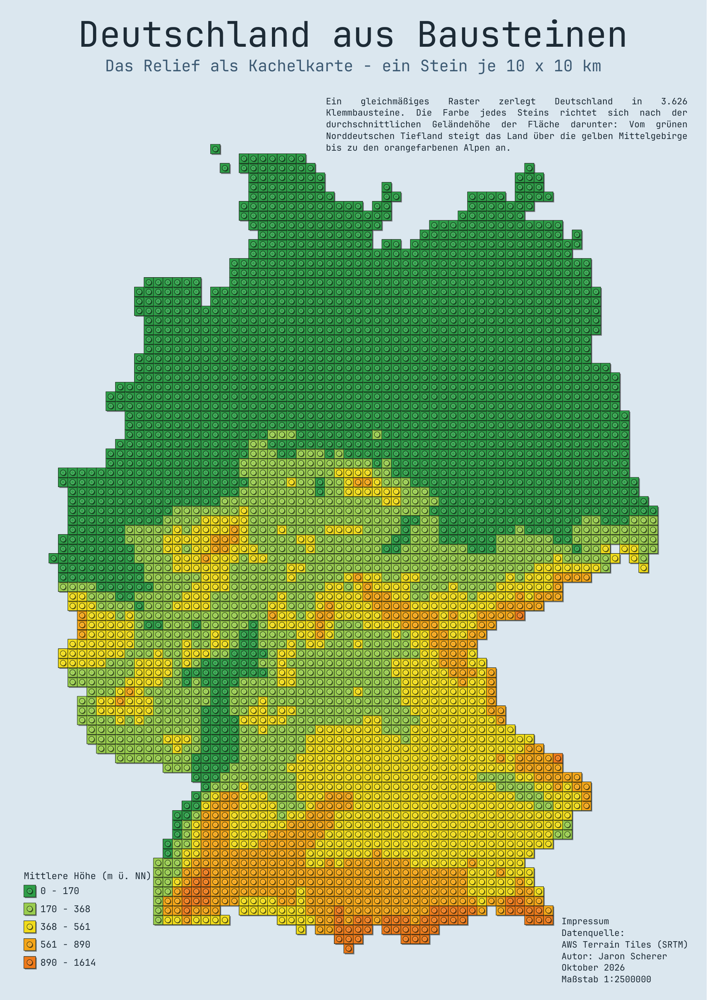
</td>
</tr>
</table>

## EP 01 | Dasymetrische Choroplethenkarten

### Vor- und Nachteile der Methode

Eine klassische Choroplethenkarte verteilt einen Wert gleichmäßig über die ganze Bezugsfläche – auch über Wälder, Seen und Gewerbegebiete, in denen niemand wohnt. Die dasymetrische Karte bezieht die Einwohner dagegen nur auf die Flächen, die tatsächlich bewohnt sind. Dadurch wird sichtbar, wie dicht dort gewohnt wird, wo überhaupt gewohnt wird, und große, dünn besiedelte Randgebiete wirken nicht mehr künstlich verdichtet oder ausgedünnt.

Der Preis dafür ist ein höherer Aufwand: Man braucht zusätzlich einen möglichst aktuellen Datensatz zur Flächennutzung, dessen Fehler direkt ins Ergebnis eingehen. Innerhalb der Wohnflächen bleibt die Verteilung trotzdem gleichmäßig – ob dort Einfamilienhäuser oder Hochhäuser stehen, unterscheidet die Methode nicht. Das Ergebnis ist genauer, aber weiterhin ein Modell.

<a href="EP01_Berlin_Bevoelkerung.pdf">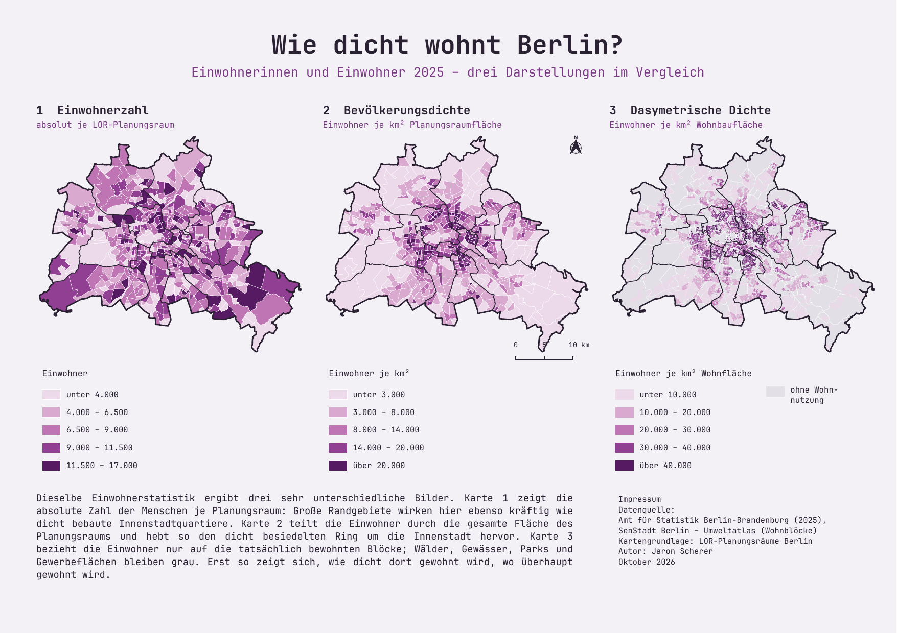</a>

Klick auf die Karte öffnet das georeferenzierte PDF · <a href="EP01_Berlin_Bevoelkerung.pdf">EP01_Berlin_Bevoelkerung.pdf</a>

### Umsetzung der Methode

Die Einwohnerzahlen des Amts für Statistik Berlin-Brandenburg (Stand 2025) wurden über die Schlüsselnummer mit den 542 LOR-Planungsräumen verknüpft. Daraus entstanden drei Karten nebeneinander: die absolute Einwohnerzahl, die Dichte je km² Planungsraumfläche und die dasymetrische Dichte. Für die dritte Karte wurden die Planungsräume mit den Wohnblöcken aus dem Umweltatlas Berlin verschnitten und die Einwohner nur auf diese Wohnfläche bezogen. Alle drei Karten nutzen dieselbe fünfstufige Farbskala von Hellrosa bis Violett; Flächen ohne Wohnnutzung bleiben grau.

#### Gleiche Zahlen, drei verschiedene Städte.

## EP 02 | Gitterchoroplethenkarten

### Vor- und Nachteile der Methode

Gitterchoroplethenkarten fassen Punktdaten in gleich großen Zellen zusammen. Weil jede Zelle dieselbe Fläche hat, lassen sich Häufungen direkt vergleichen, ohne dass unterschiedlich große Bezirke oder Planungsräume das Bild verzerren. Hexagone haben dabei den Vorteil, dass alle Nachbarzellen gleich weit entfernt sind und das Raster organischer wirkt als ein Quadratgitter.

Gleichzeitig gehen die genauen Standorte verloren: Ob die Bäume einer Zelle an einer Allee stehen oder verstreut im Park, ist nicht mehr zu erkennen. Auch Größe und Lage des Gitters beeinflussen das Ergebnis – ein verschobenes oder gröberes Raster kann Schwerpunkte teilen oder verwischen.

<a href="EP02_Kirschbaeume_Hexagon.pdf">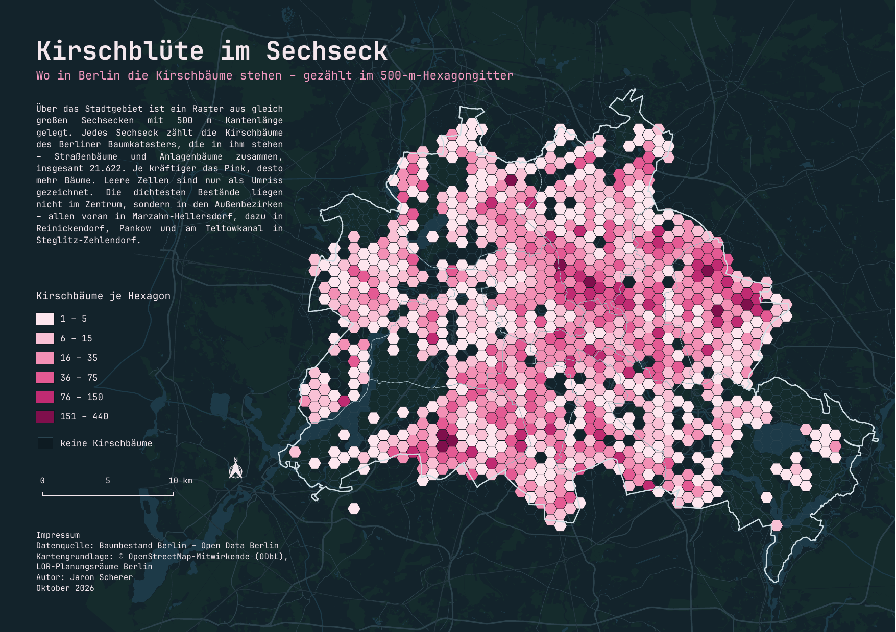</a>

Klick auf die Karte öffnet das georeferenzierte PDF · <a href="EP02_Kirschbaeume_Hexagon.pdf">EP02_Kirschbaeume_Hexagon.pdf</a>

### Umsetzung der Methode

Grundlage sind 21.622 Kirschbäume aus dem Berliner Baumbestand (Open Data Berlin), Straßen- und Anlagenbäume zusammen. Über das Stadtgebiet wurde ein Hexagongitter mit 500 m Kantenlänge gelegt und die Bäume je Zelle gezählt. Zellen mit Bäumen wurden in sechs Klassen von Zartrosa bis Weinrot eingefärbt, leere Zellen nur als Umriss gezeichnet. Ein dunkler Stadtplan aus OpenStreetMap-Daten (Gewässer, Wälder, Hauptstraßen, Bahn) gibt Orientierung, ohne den Hexagonen die Show zu stehlen.

#### Die meisten Kirschbäume blühen nicht im Zentrum, sondern in Marzahn-Hellersdorf.

## EP 03 | Punktrasterkarten

### Vor- und Nachteile der Methode

Punktrasterkarten setzen an regelmäßige Rasterpunkte je ein Symbol, dessen Größe oder Farbe den Wert zeigt. Weil die Flächen dazwischen frei bleiben, bleibt die Hintergrundkarte lesbar, und ein thematisches Symbol – hier eine Kirschblüte – macht das Thema sofort verständlich.

Dafür lassen sich Mengen über Symbolgrößen nur grob abschätzen, besonders bei verspielten Formen. Große Symbole können sich überlappen, und die Position eines Symbols ist nur der Mittelpunkt der Zelle, nicht der tatsächliche Baumstandort.

<a href="EP03_Kirschbluete_Punktraster.pdf">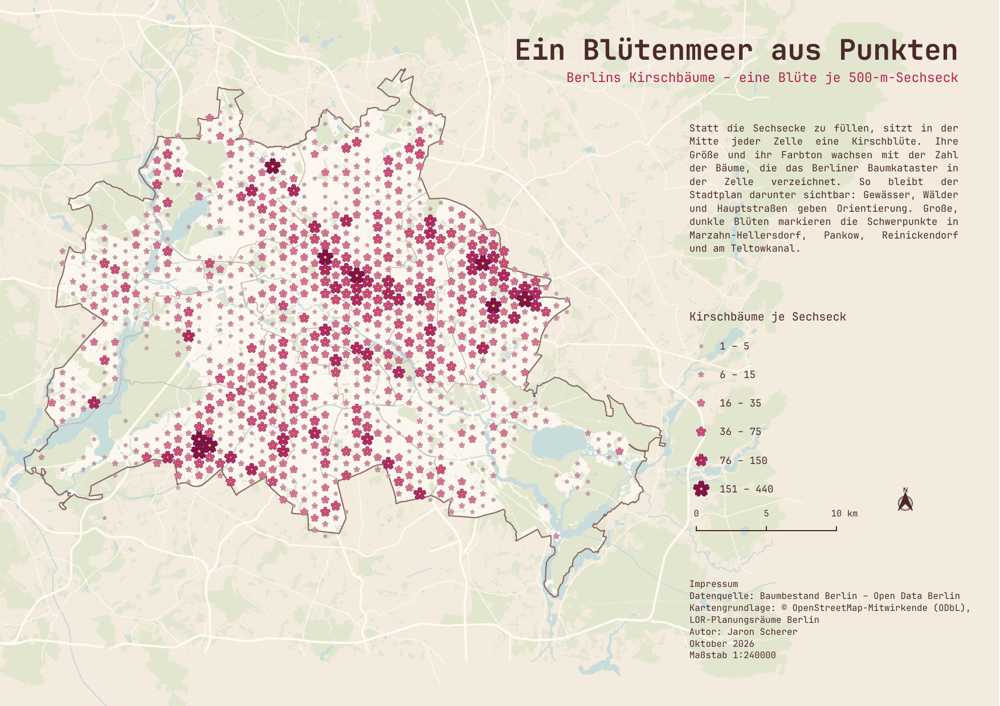</a>

Klick auf die Karte öffnet das georeferenzierte PDF · <a href="EP03_Kirschbluete_Punktraster.pdf">EP03_Kirschbluete_Punktraster.pdf</a>

### Umsetzung der Methode

Ausgangspunkt war das Hexagongitter aus EP 02. Statt der Flächen wurde der Mittelpunkt jeder belegten Zelle mit einer selbst gezeichneten, fünfblättrigen Kirschblüte (SVG) markiert. In sechs Klassen wachsen die Blüten von 1,5 mm auf 5,9 mm und werden dabei von Rosa zu Dunkelrot; die größten werden zuletzt gezeichnet, damit sie oben liegen. Ein heller, papierfarbener Stadtplan mit Gewässern, Grünflächen und Hauptstraßen bildet den Hintergrund.

#### Aus dem Gitter wurde ein Blütenmeer.

## EP 04 | Value-by-Alpha Mapping

### Vor- und Nachteile der Methode

Value-by-Alpha verbindet zwei Informationen in einer Fläche: Der Farbton zeigt hier, welche Partei einen Wahlkreis gewonnen hat, die Deckkraft, wie deutlich. Knappe Rennen treten zurück, klare Siege springen ins Auge – ein Vergleich, für den man sonst zwei Karten bräuchte.

Sehr transparente Flächen sind allerdings schwer einer Partei zuzuordnen und können wie fehlende Daten wirken. Die Wirkung hängt stark vom Hintergrund ab, und wie bei jeder Choroplethenkarte wirken große, dünn besiedelte Wahlkreise wichtiger als kleine städtische.

<a href="EP04_Wahlen_Ungarn_VbA.pdf">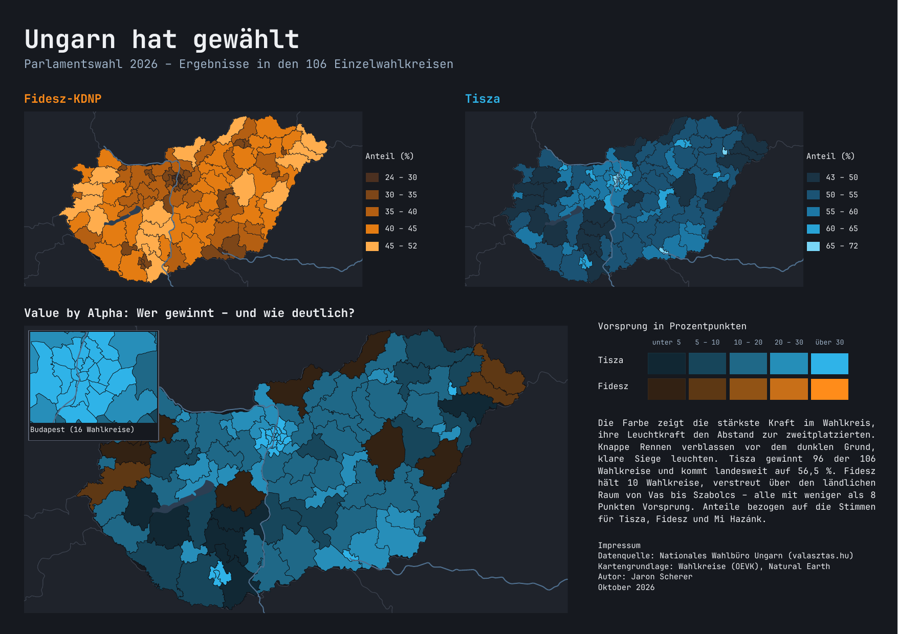</a>

Klick auf die Karte öffnet das georeferenzierte PDF · <a href="EP04_Wahlen_Ungarn_VbA.pdf">EP04_Wahlen_Ungarn_VbA.pdf</a>

### Umsetzung der Methode

Die Ergebnisse der ungarischen Parlamentswahl 2026 wurden mit den Geometrien der 106 Einzelwahlkreise verknüpft. Zwei kleine Choroplethenkarten zeigen die Stimmenanteile von Fidesz-KDNP und Tisza. In der großen Karte erhält jeder Wahlkreis die Farbe des Siegers, die Deckkraft ergibt sich aus dem Vorsprung in Prozentpunkten (fünf Stufen). Bewusst wurde ein dunkler Hintergrund gewählt: Knappe Ergebnisse verblassen ins Dunkle, deutliche Siege leuchten. Ein Ausschnitt vergrößert die 16 Budapester Wahlkreise.

#### Tisza gewinnt 96 von 106 Wahlkreisen – Fidesz' zehn Siege sind alle knapp.

## EP 05 | Ursprung-Ziel-Karten

### Vor- und Nachteile der Methode

Ursprung-Ziel-Karten zeigen, wohin Menschen, Waren oder Informationen von einem Ort aus gelangen. Linienfarbe und -stärke machen auf einen Blick klar, welche Ziele bedeutend sind. Je mehr Ziele es gibt, desto stärker überlagern sich die Linien jedoch rund um den Ursprung. Wichtig ist außerdem: Die Linien verbinden nur Herkunft und Ziel – sie sind keine tatsächlichen Fluchtwege. Die Globusansicht wirkt anschaulich, zeigt aber nur eine Erdhälfte und staucht den Rand.

<a href="EP05_Sudan.pdf">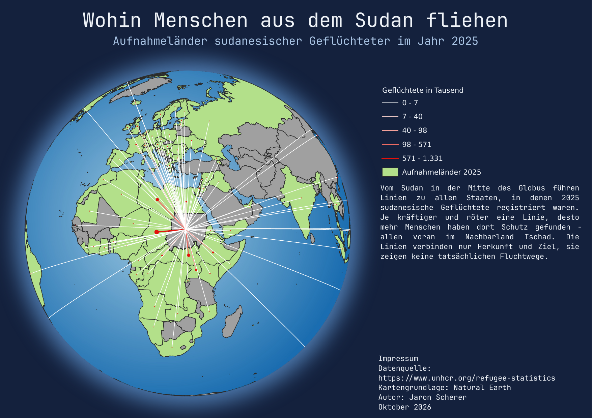</a>

Klick auf die Karte öffnet das georeferenzierte PDF · <a href="EP05_Sudan.pdf">EP05_Sudan.pdf</a>

<a href="EP05_Irak.pdf">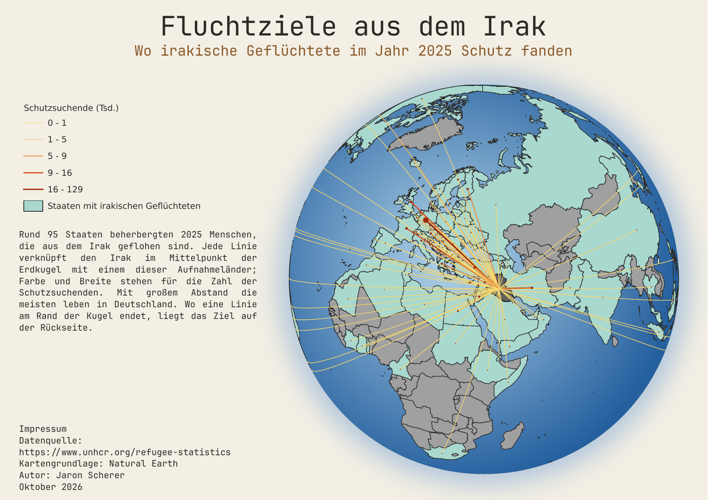</a>

Klick auf die Karte öffnet das georeferenzierte PDF · <a href="EP05_Irak.pdf">EP05_Irak.pdf</a>

### Umsetzung der Methode

Aus der UNHCR-Flüchtlingsstatistik wurden alle Aufnahmeländer von Geflüchteten aus dem Sudan und dem Irak für 2025 ausgewählt und mit den Ländergeometrien von Natural Earth verbunden. Von jedem Herkunftsland führt eine Linie zu jedem Aufnahmeland; Farbe und Breite stehen für die Zahl der Schutzsuchenden. Die Aufnahmeländer sind farbig hervorgehoben. Eine orthographische Projektion mit dem Herkunftsland im Mittelpunkt sorgt für den Globus-Effekt. Beim Sudan liegt der Schwerpunkt im Nachbarland Tschad, beim Irak mit großem Abstand in Deutschland.

#### Zwei Herkunftsländer, zwei völlig verschiedene Muster.

## EP 06 | Tilemaps

### Vor- und Nachteile der Methode

Tilemaps übersetzen einen Raum in gleich große Kacheln und machen ihn dadurch einfach und einprägsam. In Klemmbaustein-Optik wird das Relief Deutschlands fast spielerisch lesbar: Tiefland, Mittelgebirge und Alpen heben sich klar voneinander ab. Die Vereinfachung hat aber ihren Preis – Grenzverläufe werden treppig, und weil jede Kachel nur die mittlere Höhe zeigt, verschwinden einzelne Gipfel und Täler. Für genaue Geländeanalysen ist die Karte nicht gedacht.

Klick auf die Karte öffnet das georeferenzierte PDF · <a href="EP06_Tilemap_DE.pdf">EP06_Tilemap_DE.pdf</a>

### Umsetzung der Methode

Über Deutschland wurde ein Raster aus 10 × 10 km großen Quadraten gelegt und auf die Zellen innerhalb der Landesgrenze reduziert – insgesamt 3.626 Steine. Für jede Zelle wurde aus dem Höhenmodell (AWS Terrain Tiles, SRTM) die mittlere Geländehöhe berechnet und in fünf Klassen von Grün über Gelb bis Orange eingefärbt. Jede Kachel bekam eine Noppe und einen leichten Schatten, damit sie wie ein Klemmbaustein wirkt. Das Ergebnis ist als A3-Layout ausgegeben.

#### Deutschland zum Nachbauen.

## EP 07 | Animation in QGIS

### Vor- und Nachteile der Methode

Animierte Karten zeigen neben dem Wo auch das Wann. Bei einem Meteorschauer lässt sich so verfolgen, wie die Zahl der Sternschnuppen im Laufe der Nacht anschwillt und wieder abnimmt. Einzelne Ereignisse sind aber kurz und leicht zu übersehen, verschiedene Zeitpunkte lassen sich schlecht direkt vergleichen, und die Abspielgeschwindigkeit prägt den Eindruck. Außerdem zeigen die Daten nur, was Kameras erfasst haben: Leere Regionen bedeuten oft Wolken oder fehlende Stationen, nicht fehlende Meteore.

### Perseiden-Schauer 2026
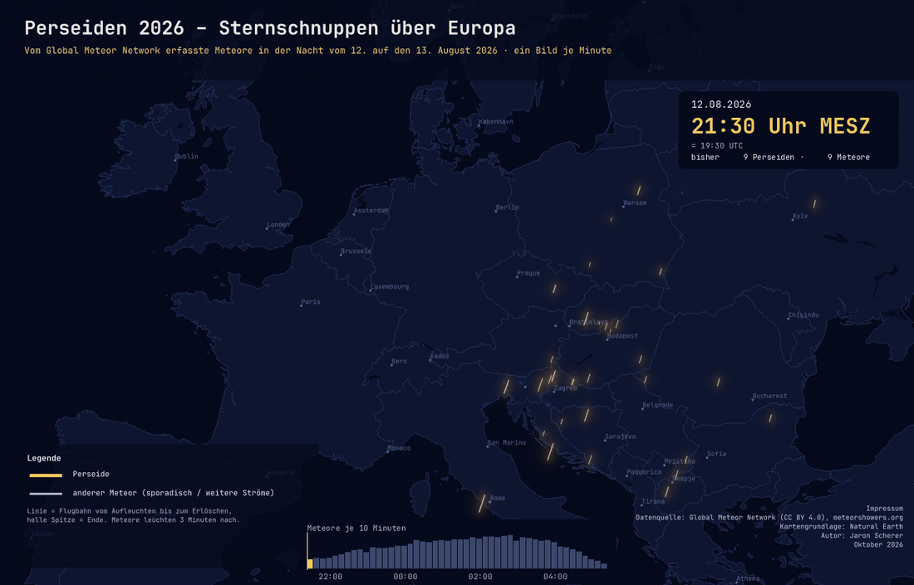

### Geminiden-Schauer 2025
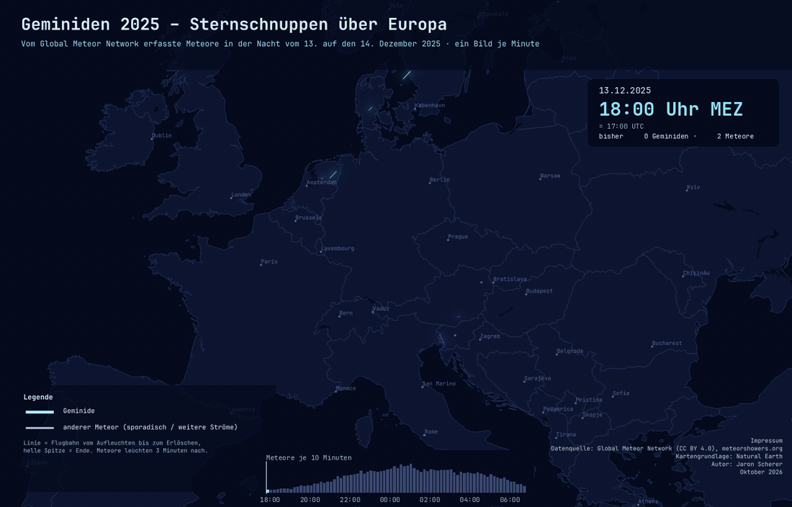

### Umsetzung der Methode

Die Flugbahnen stammen aus den täglichen Trajektoriendaten des Global Meteor Network (über meteorshowers.org). Für jeden Meteor wurden Anfangs- und Endpunkt zu einer Linie verbunden und mit einem Zeitstempel versehen. In QGIS steuert die zeitliche Steuerung, welche Meteore sichtbar sind – in minutengenauen Schritten, mit drei Minuten Nachleuchten. Ein Farbverlauf entlang der Linie mit äußerem Glühen erzeugt den Kometenschweif; Hauptstrom und übrige Meteore sind farblich getrennt. Uhrzeit, Zähler und eine Zeitleiste ordnen jedes Bild ein. Die Einzelbilder (480 für die Perseiden, 780 für die lange Dezembernacht der Geminiden) wurden als PNG exportiert und zu GIFs zusammengesetzt.

#### Im August regnet es Sternschnuppen über ganz Europa – im Dezember nur dort, wo der Himmel klar war.

## EP 08 | Mesh-Daten

### Vor- und Nachteile der Methode

Mesh-Daten speichern Werte auf einem Netz aus Knoten und eignen sich deshalb gut für kontinuierliche, zeitlich veränderliche Größen wie Windfelder. Stromlinien machen die Strömung unmittelbar sichtbar, und in der Animation sieht man, wie ein Sturmtief entsteht und weiterzieht. Eine dichte, malerische Darstellung erschwert allerdings die Orientierung, genaue Werte lassen sich nur über die Farbskala grob ablesen, und die Auflösung der Ausgangsdaten (hier 0,25°, stündlich) begrenzt den Detailgrad.

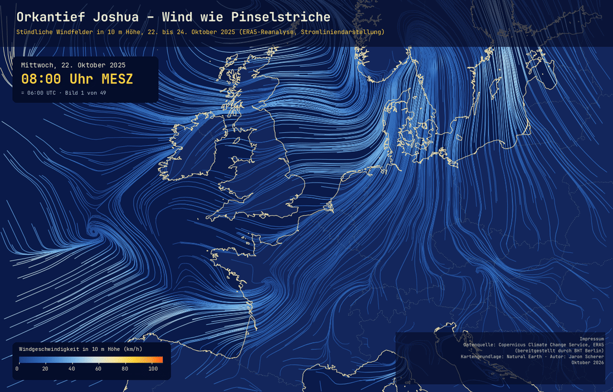

### Umsetzung der Methode

Der GRIB-Datensatz (ERA5-Reanalyse, bereitgestellt durch die BHT Berlin) wurde in QGIS als Netzlayer geladen; die Windkomponenten in 10 m Höhe ergeben ein Vektorfeld. Dargestellt wird es als Stromlinien, die nach Windgeschwindigkeit von Tiefblau über Hellblau und Creme bis Gelb und Orange eingefärbt sind – eine Anlehnung an van Goghs Pinselstriche auf ultramarinblauem Grund. Für den Zeitraum vom 22. bis 24. Oktober 2025 wurde jede Stunde als Bild mit Titel, Uhrzeit, Farbskala und Impressum exportiert und zu einem GIF zusammengefügt. Man sieht, wie Orkantief Joshua (in Frankreich „Benjamin“) von der Biskaya über den Ärmelkanal bis nach Dänemark zieht.

#### Ein Sturm, gemalt mit 49 Pinselstrichen.

## EP 09 | 3D-Gebäudemodelle

### Vor- und Nachteile der Methode

2,5D- und 3D-Darstellungen machen Gebäudehöhen und Stadtstrukturen begreifbarer als ein reiner Grundriss. Die 2,5D-Ansicht bleibt dabei eine maßstäbliche, leicht zu erstellende Karte mit räumlichem Eindruck. Ein echtes 3D-Modell zeigt zusätzlich Dachformen, Gelände und Luftbild. Allerdings verdecken hohe Gebäude je nach Blickwinkel andere Objekte, Entfernungen lassen sich in der Schrägansicht nicht mehr messen, und 3D-Modelle brauchen deutlich mehr Rechenleistung. In 2,5D bekommt außerdem jedes Gebäude nur eine einzige Höhe – Türme und Dachformen gehen verloren.

### München in 2,5D

<a href="EP09_Muenchen_2-5D.pdf">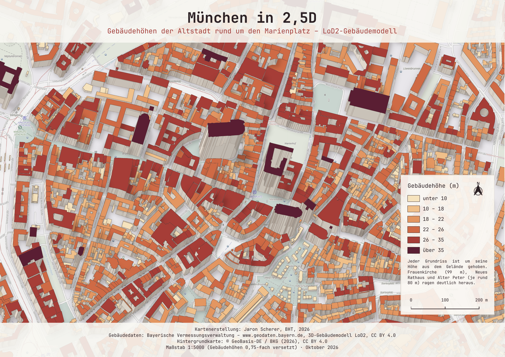</a>

Klick auf die Karte öffnet das georeferenzierte PDF · <a href="EP09_Muenchen_2-5D.pdf">EP09_Muenchen_2-5D.pdf</a>

### Freiburg im Breisgau in 3D

<a href="EP09_Freiburg_3D.pdf">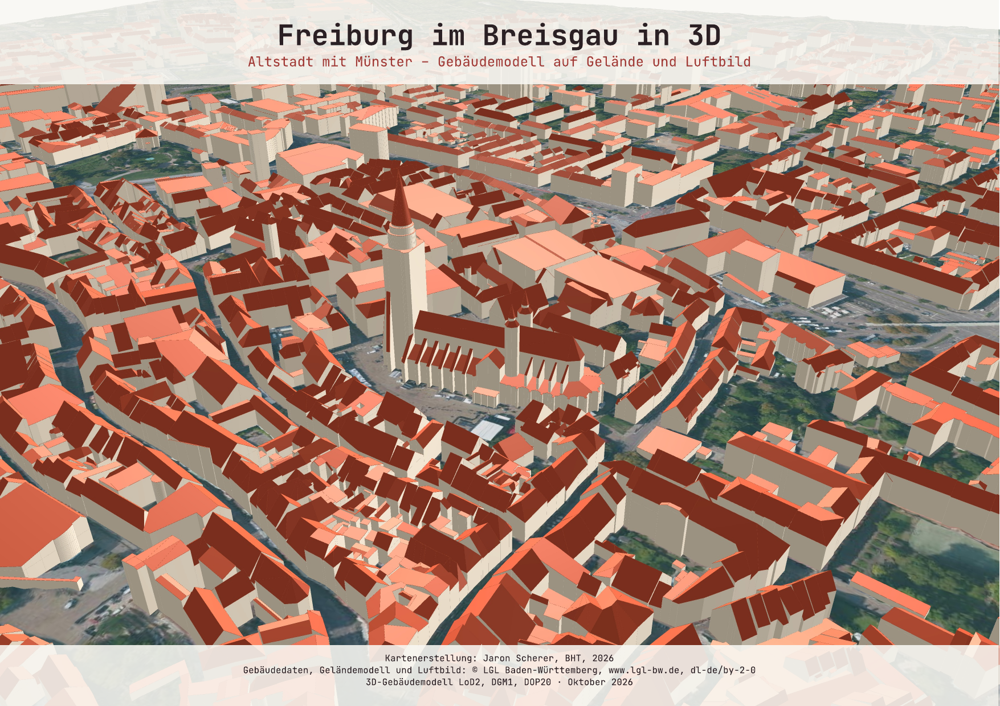</a>

Klick auf die Karte öffnet das PDF · <a href="EP09_Freiburg_3D.pdf">EP09_Freiburg_3D.pdf</a>

### Umsetzung der Methode

Für München wurden die LoD2-Gebäude der Bayerischen Vermessungsverwaltung rund um den Marienplatz eingelesen und aus den Dach- und Bodenflächen Grundrisse mit Gebäudehöhe abgeleitet. Die 2,5D-Wirkung entsteht in QGIS über Geometriegeneratoren: Die Wände werden aus den Grundrisskanten extrudiert und nach ihrer Ausrichtung schattiert, das Dach wird um die Gebäudehöhe versetzt und nach sechs Höhenklassen eingefärbt. Eine Sortierung von hinten nach vorne sorgt dafür, dass vordere Gebäude die hinteren verdecken. Hintergrund ist die entsättigte basemap.de im Maßstab 1:5000. Für Freiburg wurden LoD2-Gebäude, Geländemodell (DGM1) und Luftbild (DOP20) des LGL Baden-Württemberg in einer QGIS-3D-Ansicht kombiniert, sodass Altstadt, Münster und Schlossberg auf echtem Gelände stehen.

#### Zum Schluss ging es hoch hinaus – vom Münchner Rathausturm bis auf den Freiburger Schlossberg.
